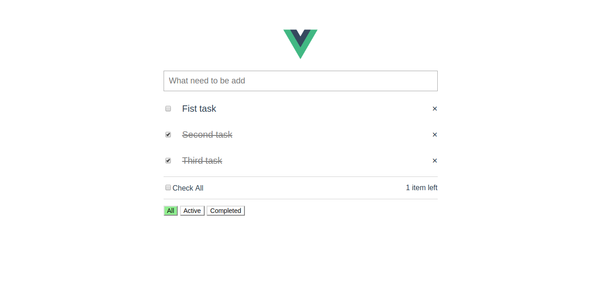

# first_vue

This is my first vue project just for learning purpose. In this I was trying to understand how this framework works

## Features
* Add new task
* Delete old task
* mark as checked
* filter option for listing

## Snapshot

